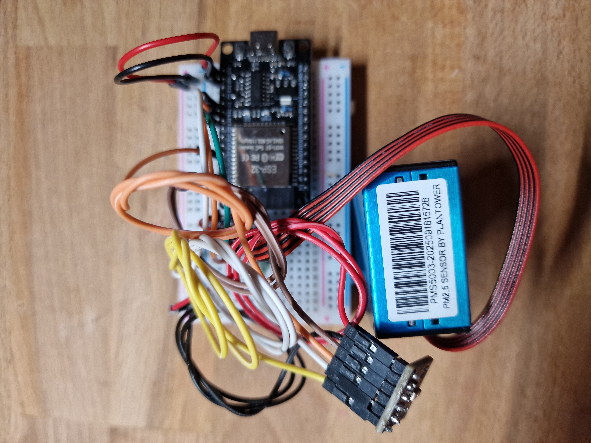
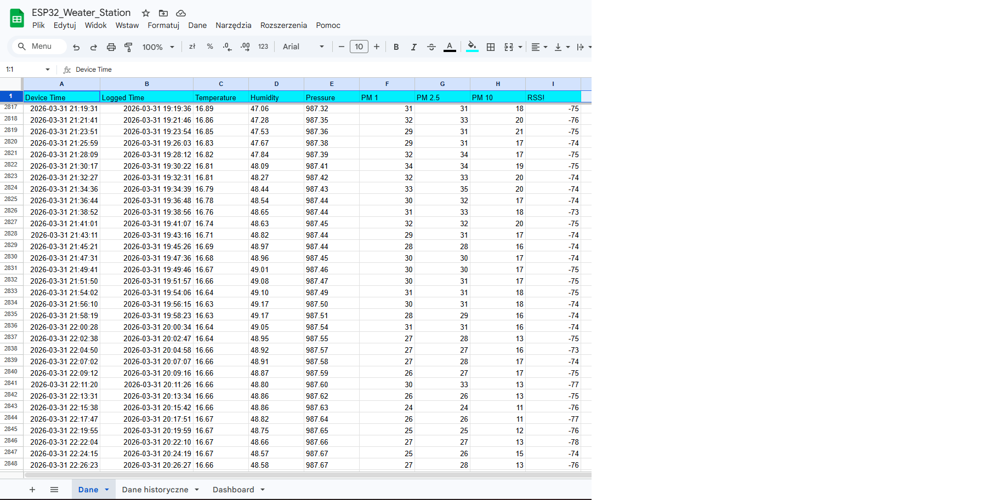

# ESP32 Air Quality Monitoring Station

IoT air quality monitoring system based on ESP32, PMS5003 and BME280.

---

## Features

### Embedded sensing
- PM1 / PM2.5 / PM10 measurement (PMS5003)
- Temperature, humidity, pressure measurement (BME280)
- Median filter (removes sensor spikes)
- EMA filter (smooth environmental data)
- Humidity correction for PM measurements
- Physical validation: PM1 ≤ PM2.5 ≤ PM10

### Sensor reliability
- Sensor duty cycle (reduced wear and heating)
- Auto clean cycle (improves long-term stability)
- Power filtering with capacitors for more stable operation

### Cloud logging
- Data transmission over WiFi
- HTTP integration with Google Apps Script
- Automatic logging to Google Sheets

### Automation and integrations
- Ready for n8n workflow automation
- Designed for Telegram-based user interaction
- Extendable with external weather data (e.g. OpenWeather)

---

## Hardware

- ESP32 DevKit
- PMS5003 particulate matter sensor
- BME280 environmental sensor
- Capacitors: 220µF + 100nF (power filtering)

---

## System Architecture

The platform consists of four connected layers:

1. **Sensor layer** – PMS5003 and BME280 collect environmental data
2. **Embedded layer** – ESP32 filters, validates and transmits measurements over WiFi
3. **Cloud layer** – Google Apps Script receives HTTP requests and stores records in Google Sheets
4. **Automation layer** – n8n workflows process data and enable integrations such as Telegram and external weather APIs

**Main data flow:**  
Sensors → ESP32 → WiFi → Google Apps Script → Google Sheets → n8n → Telegram / AI assistant


---

## Data Processing

This project implements several techniques used in real-world air monitoring systems:

- Median filter (5 samples)
- Exponential Moving Average (EMA)
- Humidity-based correction of PM values
- Physical validation: PM1 ≤ PM2.5 ≤ PM10

---

## Sensor Management

- Duty cycle mode (reduces overheating and dust buildup)
- Cleaning cycle every few hours (airflow flush)

---

## Cloud Integration

The ESP32 sends processed measurements over WiFi using HTTP requests to a Google Apps Script web app.  
The script validates incoming records and appends them to Google Sheets, which acts as a lightweight cloud datastore for the project.

This layer provides:
- remote data persistence
- simple historical logging
- easy inspection of measurements
- a practical integration point for further automation with n8n

---

## Automation and Extensions

The project is designed to be extended beyond raw data logging into a broader monitoring and interaction platform.

Planned and partially implemented extension areas include:
- **n8n workflows** for data processing, routing and automation
- **Telegram integration** for text-based and voice-based access to measurements
- **AI assistant logic** for natural-language questions about current and historical sensor data
- **external weather enrichment** using sources such as OpenWeather for outdoor context

These extensions turn the station from a standalone sensor node into an end-to-end IoT monitoring platform.

---

## Use Cases

Example use cases for the platform include:
- continuous indoor air quality monitoring
- long-term environmental data logging
- remote inspection of sensor readings through Google Sheets
- workflow-based automation using n8n
- conversational access to measurements through Telegram
- combining local sensor data with external weather context

---

## Prototype

Breadboard prototype of the air quality monitoring station:



---

## Documentation

Additional project documentation is available in PDF format:

- [Air Quality Station Documentation](docs/air_quality_station_documentation.pdf)

---

## Results

Example sensor records logged to Google Sheets:



The collected dataset can be used for:
- historical trend inspection
- basic anomaly detection
- comparison of indoor conditions over time
- future automation and conversational querying through n8n and Telegram

---

## Project Structure

```text
.
├── docs/
│   └── air_quality_station_documentation.pdf
├── images/
│   ├── google_sheets_data.png
│   ├── prototype.jpg
│   └── system_architecture.jpg
├── src/                        # ESP32 firmware
├── README.md

---

## Author

Tomek B
