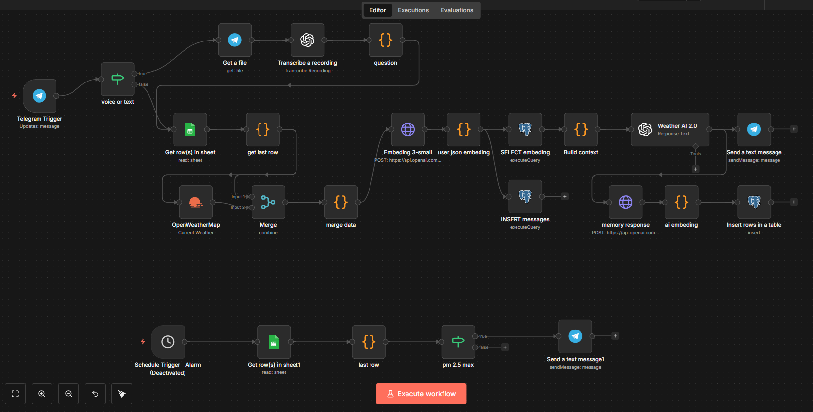
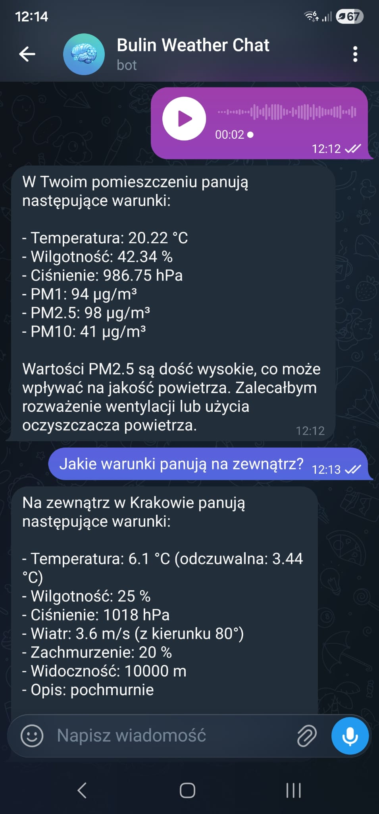

# ESP32 Air Quality Monitoring Station

IoT air quality monitoring platform based on ESP32, PMS5003 and BME280, with data logging to Google Sheets.

---

## Features

- PM1 / PM2.5 / PM10 measurement
- Temperature, humidity and pressure measurement
- Median filter and EMA smoothing
- Humidity correction for PM values
- Sensor duty cycle and cleaning cycle
- WiFi data transmission
- Google Sheets logging via Google Apps Script
- Ready for future n8n and Telegram integration

---

## Hardware

- ESP32 DevKit
- PMS5003 particulate matter sensor
- BME280 environmental sensor
- Capacitors: 220µF + 100nF

---

## System Architecture

Sensors → ESP32 → WiFi → Google Apps Script → Google Sheets

Future extension: Google Sheets → n8n → Telegram

---

## Prototype

Breadboard prototype of the air quality monitoring station:

---

## Results

Example sensor records logged to Google Sheets:

---

## Documentation

- [Air Quality Station Documentation](docs/air_quality_station_documentation.pdf)

---

## Integrations Preview

Example n8n workflow:

Example Telegram interaction:

Sanitized n8n workflow export for Telegram, OpenWeather and AI response handling:
- [telegram-workflow.json](n8n/telegram-workflow.json)

---

## Author

Tomek B
